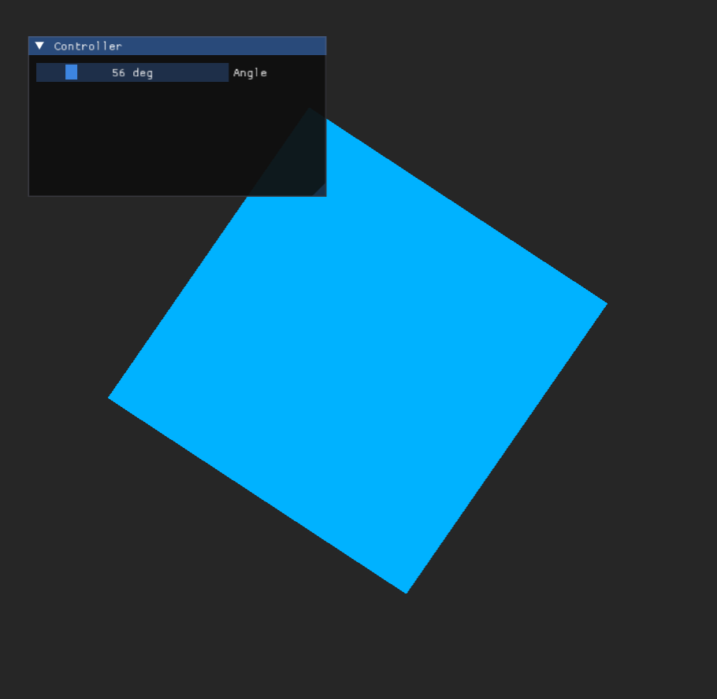

# opengldemo

Modern OpenGL (DSA), C++23 ve shader sıcak yenileme (hot-reload) özelliklerine sahip, yüksek performanslı bir grafik uygulama şablonu.



## Özellikler

- **Modern OpenGL (4.5+ DSA):** Direct State Access (DSA) kullanarak daha temiz ve verimli nesne yönetimi (VAO, VBO, vb.).
- **Sıcak Yenileme (Hot-Reload):** Shader dosyalarında yaptığınız değişiklikler, uygulama çalışırken anında algılanır ve otomatik olarak yeniden derlenip bağlanır.
- **Entegre UI:** Geliştirme sürecini kolaylaştırmak için [ImGui](https://github.com/ocornut/imgui) entegrasyonu mevcuttur.
- **Hızlı Loglama:** [spdlog](https://github.com/gabime/spdlog) ile yüksek performanslı günlük tutma.
- **C++23:** En güncel C++ standartlarını (C++23) temel alan modern kod yapısı.

## Bağımlılıklar

Projeyi derlemek için aşağıdaki kütüphanelerin sisteminizde yüklü olması veya `vendor` klasörü altında bulunması gerekmektedir:

- **CMake (4.3+):** Proje yönetim ve derleme sistemi.
- **GLFW:** Pencere yönetimi ve girdi işleme.
- **spdlog:** Günlükleme (logging) kütüphanesi.
- **GLAD:** OpenGL yükleyici (proje ile birlikte gelir).
- **ImGui:** Kullanıcı arayüzü (proje ile birlikte gelir).
- **FileWatch:** Dosya değişiklik takibi (hot-reload için).

## Kurulum ve Derleme

### Linux / macOS

```bash
# Depoyu klonlayın
git clone https://github.com/kullaniciadi/opengldemo.git
cd opengldemo

# Derleme dizini oluşturun
mkdir build && cd build

# CMake ile yapılandırın ve derleyin
cmake ..
make
```

### Windows

CMake GUI veya Visual Studio'yu kullanarak `CMakeLists.txt` dosyasını içe aktarabilir ve projeyi derleyebilirsiniz.

## Kullanım

Uygulamayı çalıştırdığınızda karşınıza dönen bir kare ve bir ImGui kontrol paneli çıkacaktır.

### Sıcak Yenileme (Hot-Reload)
`shaders/test.vert` veya `shaders/test.frag` dosyalarında bir değişiklik yapıp kaydettiğinizde, uygulama kapanmadan değişiklikler ekrana yansıyacaktır. Örneğin:

1. `shaders/test.frag` dosyasını açın.
2. `outColor = vec4(1.0, 0.5, 0.2, 1.0);` satırındaki renk değerlerini değiştirin.
3. Dosyayı kaydedin.
4. Uygulamadaki karenin renginin anında değiştiğini göreceksiniz.

## Proje Yapısı

- `include/`: Başlık (header) dosyaları.
- `src/`: Kaynak kodlar.
- `shaders/`: GLSL shader dosyaları.
- `vendor/`: Üçüncü taraf kütüphaneler (ImGui, Glad, FileWatch).
- `docs/`: Proje dokümantasyonu ve görseller.

## Lisans

Bu proje [MIT Lisansı](LICENSE) altında lisanslanmıştır.
